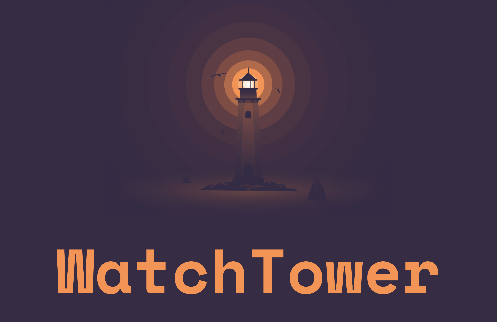

 

## Table of Contents

- [Introduction](#introduction)
- [Automation](#automation)
- [Technologies Used](#technologies-used)
- [Features](#features)
- [Future Scope](#future-scope)
- [License](#license)

# Introduction

WatchTower is a specialized platform created to aggregate cybersecurity news by utilizing the Scrapy library in Python, along with additional libraries such as Pandas, Requests, Datetime,etc. for efficient data processing. The platform extracts information from three specified websites, consolidates the data into a unified JSON file, and subsequently utilizes this file to display the curated information on its website.

 

# Automation

This project leverages Digital Ocean's droplet to automate a web scraping process using a Bash script. The script is set to run at specified intervals every day, utilizing the cron scheduler. The primary goal is to execute the web scraper, generate a consolidated JSON data file, and seamlessly push all changes to this repository.

## How it Works

1. **Digital Ocean Droplet Setup :** The project relies on a Digital Ocean droplet for automation.

2. **Bash Script :** A bash script has been crafted to orchestrate the entire process. It triggers the web scraper, collects data, compiles it into a unified JSON file, and handles the GitHub commit and push operations.

3. **Cron Job Scheduling :** The script is scheduled to run at specified intervals using cron. This ensures that the web scraper executes automatically at the defined times each day.

4. **GitHub Integration :** All changes, including the updated JSON file, are automatically committed and pushed to the GitHub repository associated with this project.

5. **Vercel Deployment :** After all changes are pushed to the repository, vercel automatically deploys the website with latest information. 

 

# Technologies Used

  <a href="https://skillicons.dev">
    
    
    
  </a>

 

# Features

- Powerful Scrapy Library Integration
- Efficient Data Processing
- Aggregation from Three Specified Websites
- User-Friendly Website Display

 

# Future Scope
- **Extended Data Sources :** Integrate additional cybersecurity news websites or APIs to broaden the scope of information gathered, offering a more comprehensive overview.
- **Community Collaboration :** Foster collaboration within the InfoSec community by inviting external contributors to enhance the project. This can lead to the addition of new features, improvements, and bug fixes.
- **Notification System:** Implement a notification system to alert users about critical cybersecurity updates or customized alerts based on their preferences.

<i>Feel free to provide any feedback, suggestions, and future scope ideas for this project. Your input is highly valued and will contribute to the ongoing improvement and evolution of the project.</i>

 

# License

This project is licensed under the [MIT License](LICENSE) - see the [LICENSE](LICENSE) file for details.

## TL;DR

- This project is licensed under the MIT License.
- You are free to use, modify, and distribute this software.
- If you choose to use, modify, or distribute this software, you must include the original license and copyright notice.
- Read the full license [here](LICENSE).
